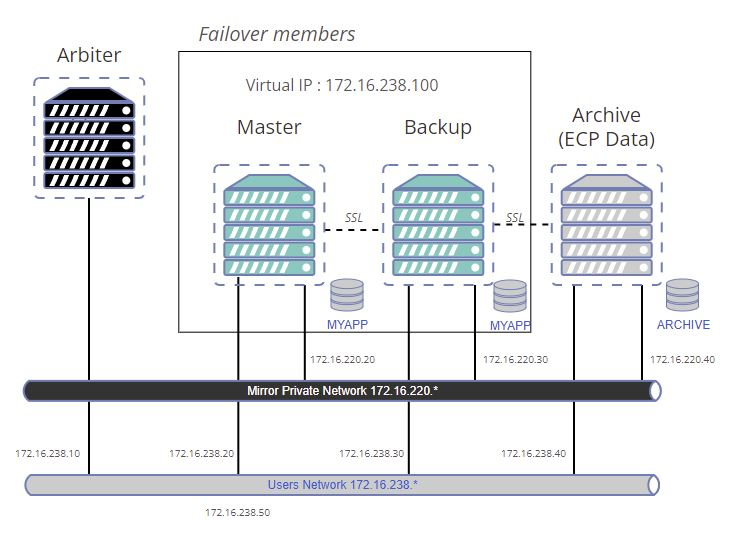

# global-archiver-sample

This is a sample to to test [global-archiver](https://github.com/lscalese/global-archiver) tool using an architecture with mirroring and ECP.  
The goal is to move a part of global from a database in a mirror to a remote archive database.  

## Prerequisites

 * WRC Access.  
 * `IRIS.key` for for container usage.  

## Prepare your system

### Get an IRIS License

If you don't have a valid Docker License for IRIS yet connect to [Worldwide Respnse Center (WRC)](https://wrc.interystems.com) with your credentials.  
Click "Actions" --> "Online distribtion", then "Evaluations" button and select "Evaluation License", fill the form.  
Copy the `iris.key` to this repository directory.  


### Create users and groups

This sample use a local directory as a volume to share database file `IRIS.DAT` between containers.  
We need to set security settings to `./backup` directory.  
If irisowner group and user does not exists yet on your system, create them.  

```bash
sudo useradd --uid 51773 --user-group irisowner
sudo groupmod --gid 51773 irisowner
sudo chgrp irisowner ./backup
```

### Login to Intersystems Containers Registry

Our [docker-compose.yml](./docker-compose.yml) uses references to `containers.intersystems.com`.  
So you need to login to Intersystems Containers Registry to pull the used images.  
If you don't remember your password for the docker login to ICR, open this page https://login.intersystems.com/login/SSO.UI.User.ApplicationTokens.cls and you can retrieve your docker token.  


```bash
docker login -u="YourWRCLogin" -p="YourPassWord" containers.intersystems.com
```

### Generate certificates

Mirroring and ECP communications are secured by tls\ssl, we need to generate certificates for each node.  
Simply use the provided script:   

```
docker pull intersystemsdc/iris-community:latest
cd ./generator
# sudo is needed due chown, chgrp, chmod ...
sudo ./gen-certificates.sh
cd ..
```

### Build and run containers

```
#use sudo to avoid permission issue
sudo docker-compose build --no-cache
docker-compose up
```

Wait a bit, there are post start executed on each node.  

Good!  
Now we have 4 containers started following this schema:  



### Test

Open an IRIS terminal on the primary node:

```bash
docker exec -it mirror-demo-master irissession iris
```

Generate data: 

```objectscript
Do ##class(lscalese.globalarchiver.sample.DataLog).GenerateData(10000)
```

Copy data older than 30 days to the ARCHIVE database:

```objectscript
Set lastId = ##class(lscalese.globalarchiver.sample.DataLog).GetLastId(30)
Set Global = $Name(^lscalese.globalarcCA13.DataLogD)
Set sc = ##class(lscalese.globalarchiver.Copier).Copy(Global, lastId, "ARCHIVE")
```

Delete archived data from the source database:

```objectscript
Set sc = ##class(lscalese.globalarchiver.Cleaner).DeleteArchivedData(Global,"ARCHIVE")
```

### Check global mapping

Open the management portal on the current primary node and check global mapping for the namespace `USER` and
compare with global mapping on the backup node.  
The global mapping for the archived data is missing on the backup node.  

Now stop the current primary to force the backup node to become primary.

```bash
docker stop mirror-demo-master
```

Check the global mapping again, and now it should be setup "OnBecomePrimary" event performed by ZMIRROR routine.  

### Check data access

Simply execute the following sql query : 

```sql
SELECT 
ID, AccessToPatientId, DateTime, Username
FROM lscalese_globalarchiver_sample.DataLog
```

Verify the Number of record, it must be 10 000 :

```sql
SELECT 
count(*)
FROM lscalese_globalarchiver_sample.DataLog
```

## Access to portals

Master : http://localhost:81/csp/sys/utilhome.csp  
Failover backup member : http://localhost:82/csp/sys/utilhome.csp  
ARCHIVE ECP Data server : http://localhost:83/csp/sys/utilhome.csp  

